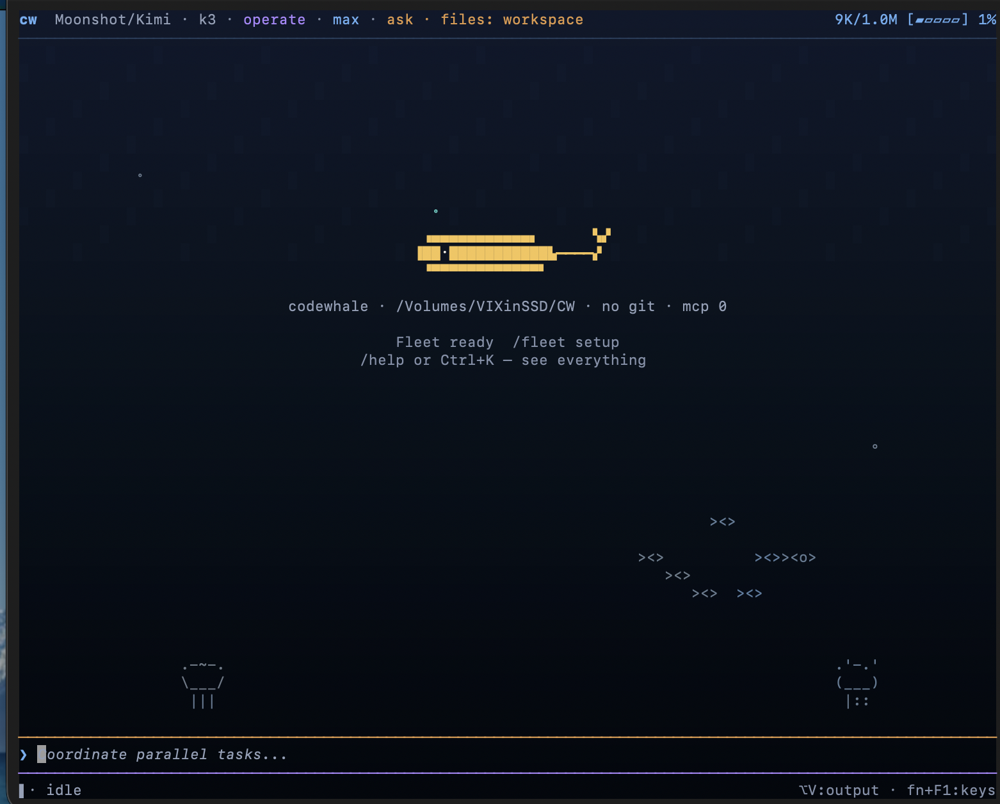

<!-- source: README.md sha256:a56bca473dbd -->
# Ghosty

Ghosty — это агент для программирования с открытым исходным кодом, работающий в терминале. Он написан на Rust и открыто развивается вместе со своими пользователями.



[English](README.md) · [简体中文](README.zh-CN.md) · [日本語](README.ja-JP.md) · [Tiếng Việt](README.vi.md) · [Bahasa Indonesia](README.id.md) · [한국어](README.ko-KR.md) · [Español](README.es-419.md) · [Português](README.pt-BR.md) · [Українська](README.uk.md) · [Français](README.fr.md) · [Deutsch](README.de.md) · [繁體中文](README.zh-TW.md) · [हिन्दी](README.hi.md) · [Türkçe](README.tr.md) · [Italiano](README.it.md) · [Polski](README.pl.md) · [العربية](README.ar.md) · [Català](README.ca.md)

[](https://github.com/blissito/ghostycode/actions/workflows/ci.yml)
[](https://crates.io/crates/ghosty-cli)
[](https://www.npmjs.com/package/ghosty)
[](https://discord.gg/37gfS3ksug)

## Установка

```bash
npm install -g ghosty
ghosty
```

При первом запуске Ghosty поможет подключить провайдера или остаться в автономном режиме. Он также поддерживает Cargo, Docker, Nix, Scoop, готовые архивы, Android/Termux и зеркало CNB. См. [руководство по установке](docs/INSTALL.md).

Для автодополнения по Tab достаточно одной команды для каждой оболочки — `ghosty completion bash|zsh|fish|powershell|elvish`. См. [автодополнение оболочки](docs/INSTALL.md#8-shell-completions).

## Использование

Обращайтесь к Ghosty так же, как к коллеге по команде:

```text
Fix the failing tests and explain what changed.
```

Задачу можно запустить и без открытия TUI:

```bash
ghosty exec "fix the failing tests and explain what changed"
```

Ghosty умеет читать ваш репозиторий, редактировать файлы, выполнять команды, проверять результаты и продолжать работу над целью. Вы сами решаете, какой доступ ему предоставить.

## Почему Ghosty

- **Используйте нужную вам модель.** Подключайте облачных провайдеров или локальные модели через Ollama, vLLM или SGLang. Переключайте провайдера и модель командой `/model`.
- **Сохраняйте контроль.** Режим Plan доступен только для чтения. Ask, Auto-Review и Full Access наглядно показывают порядок подтверждений. `/undo` отменяет последний ход, а `/restore` возвращает рабочую область к более раннему снимку.
- **Организуйте длительную работу.** Сохраняйте сеансы, задавайте постоянную `/goal`, проверяйте рабочие процессы перед запуском и координируйте агентов так, чтобы их внутренние инструкции не попадали в вашу переписку.
- **Расширяйте уже настроенного агента.** Подключайте серверы MCP и навыки, настраивайте хуки и храните роли агентов в виде понятных файлов в проекте или личных настройках.

Выполните `/help` в TUI, чтобы увидеть команды и сочетания клавиш.

## Безопасность

Ghosty работает на вашем компьютере с предоставленным вами доступом. Режимы подтверждения и правила репозитория ограничивают действия агента; дополнительная песочница ОС создаёт более строгую границу выполнения там, где она поддерживается. Неизвестная цена модели отображается как неизвестная, а не как нулевая.

Точный порядок применения политик описан в разделе [порядок авторизации](docs/AUTHORIZATION_ORDER.md), а локальные настройки — в разделе [конфигурация](docs/CONFIGURATION.md).

## Документация

- [Провайдеры и локальные модели](docs/PROVIDERS.md)
- [Команды агентов](docs/FLEET.md)
- [MCP](docs/MCP.md), [хуки](docs/HOOKS.md) и [конфигурация](docs/CONFIGURATION.md)
- [Локальный веб-клиент](docs/WEB.md)
- [Вся документация](docs)

## Присоединяйтесь к сообществу

Ghosty становится лучше, когда люди пользуются им, сообщают о неудобствах и помогают их исправить. Если нужного провайдера нет, рабочий процесс неудобен или интерфейс терминала мешает работе, [создайте issue](https://github.com/blissito/ghostycode/issues). Если вы знаете, как это улучшить, [откройте pull request](CONTRIBUTING.md). Мы рады первым вкладам, а авторство принятой работы сохраняется за участниками.

Присоединяйтесь к [Discord](https://discord.gg/37gfS3ksug) или добавьте Hunter в WeChat (`hunterbown`) и попросите принять вас в группу Whale Brothers.

## История проекта

Ghosty начинался как `deepseek-tui` и по-прежнему сохраняет совместимость с его конфигурацией и сеансами. Теперь он нейтрален к провайдерам, поддерживается независимо и не связан ни с одним поставщиком моделей.

Спасибо всем участникам и сообществам открытого исходного кода, которые помогли проекту вырасти. См. [список участников](docs/CONTRIBUTORS.md).

## Лицензия

[MIT](LICENSE). Части, адаптированные из других проектов с открытым исходным кодом, указаны в [уведомлениях о сторонних компонентах](docs/THIRD_PARTY_NOTICES.md).
